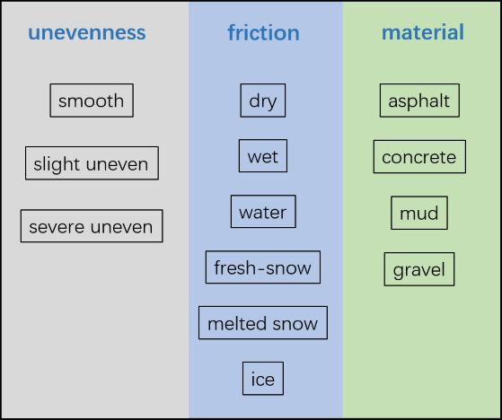

# Background

The knowledge of the road surface states is essential for improving the safety and the ride comfort of autonomous vehicles. Previewing the road conditions with vision sensor is verified to be an effective solution. However, there is still a lack of a large-scale road surface image dataset. Therefore, we publish this *Road Surface Classification Dataset (RSCD)*  containing 1 million image samples with detailed road material, friction and roughness level annotations.

# Dataset Description

## Data acquisition

The original pictures are captured with a USB camera as shown in Figure 1. To ensure a high resolution of the road surface area, the camera is mounted on the bonnet and have a certain depression angle. The pictures are collected and stored with an IPC.

Figure 1. Camera installation

Aiming at developing practical driving assistance applications, we conducted real-vehicle image acquisition under as many working conditions as possible. The generalization capability of the classification algorithm to be developed is enlarged at the dataset level. The experiments lasted from January to July, 2022 at Beijing and covered about 600 kilometers of roads.

Considering the fact that only the road area that the tires pass would affect the vehicle response, we crop the road surface area of the original pictures into patches with size 360\*240. The patches are labeled manually according to the class definition below.

## Class definition

The friction level, material, and unevenness properties of roads are essential for chassis control and driving assistance.

-   The friction level property contains six subclasses corresponding to different weather conditions, i.e. dry, wet, water, fresh snow, melted snow, and ice.
-   The road material property consists of asphalt, concrete, mud, and gravel.
-   The road unevenness is divided into smooth, slight unevenness, and severe unevenness according to the amplitude of the road undulation.

The subclasses of the three road properties are combined to form the class definition of the dataset. It should be noted that the road material and unevenness are not annotated when the friction levels are fresh snow, melted snow, or ice. Also, the unevenness is not labeled for mud or gravel roads. Finally, we get 27 combined classes. Also, researchers can use part of the labeled properties to develop their own applications.

Figure 2. Road properties and the subclasses

Image samples of part of the classes are shown in Figure 3. The number of images for each class is shown in Fig. 4.

Figure 3. Sample images of part of the classes. (a). dry-asphalt-smooth (b). dry-asphalt-slight (c). dry-asphalt-severe (d). water-asphalt-severe (e) wet-asphalt-slight (f). wet-concrete-smooth (g). wet-concrete-severe (h). water-concrete-slight (i). water-mud (j). dry-gravel (k). melted snow (l). ice.

Figure 4. Number of images for each class.
  
  
The dataset is divided into train-set(~960k samples), validation-set(~20k samples), test-set(~50k samples).    
Note： Since the experiments under rainny days are hard to conduct & label and also, the severely damaged roads are deficient, there is an inter-class imbalance problem of this dataset. The count of samples for these classes in the validation and test set are also less than others. We are concentrating on solving this problem, and the data collention for these classes are still ongoing. 

# How to Use

The RSCD is completely open to academic research. To use the dataset, please cite:

Tong Zhao, Yintao Wei, A road surface image dataset with detailed annotations for driving assistance applications, Data in Brief, 2022. doi: 10.1016/j.dib.2022.108483

Any questions, please contact us: zhaot20@mails.tsinghua.edu.cn

# Download RSCD

Figshare: [Download](https://doi.org/10.6084/m9.figshare.20424582.v3)

# Baseline

| Backbone      | Top-1 accuracy |
| :----------: | :-----------: |
| Efficientnet-B0 | 88.45% |
